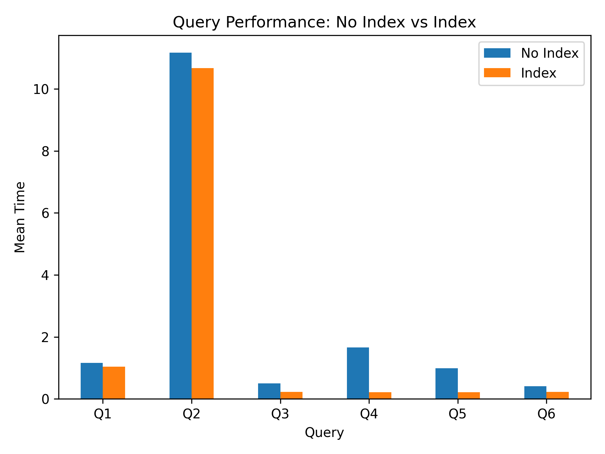

# INFORME FINAL

Este informe se estructura en seis secciones principales para ofrecer un análisis completo del rendimiento de las queries y de la base de datos:

1. **Análisis de Queries Base**  
   Evaluación del comportamiento y tiempos de ejecución de las queries en su estado original, sin ninguna optimización ni índices.

2. **Impacto de la Creación de Índices**  
   Estudio de cómo los índices específicos mejoran el rendimiento de las consultas, incluyendo comparativas de tiempos y uso de recursos.

3. **Optimización mediante Particionamiento de Tablas**  
   Exploración de estrategias de particionamiento para mejorar el acceso a grandes volúmenes de datos y reducir los costos de escaneo.

4. **Reescritura y Mejora de Queries**  
   Propuestas de optimización basadas en la reformulación de consultas SQL para aprovechar mejor los índices, joins y agregaciones.

5. **Concurrencia y Acceso Simultáneo**  
   Análisis de cómo múltiples usuarios o procesos afectan el rendimiento y estrategias para minimizar bloqueos y contención.

6. **Tuning de Servidor de Base de Datos**  
   Ajustes y recomendaciones de configuración del servidor (memoria, buffers, paralelismo, planificación de consultas) para maximizar el rendimiento general.

# 1. ANALISIS QUERIES EN ESTADO BASE

Para consultar los detalles completos de los resultados de `EXPLAIN` y `EXPLAIN ANALYZE`, revise el documento `baseline.md` ubicado en `./metricas/baseline.md`.

En este análisis se evaluaron varios queries en su estado base utilizando **EXPLAIN** y **EXPLAIN ANALYZE** para observar cómo el motor de la base de datos ejecuta cada consulta, identificar el flujo del plan de ejecución y medir su comportamiento real en términos de tiempo, filas procesadas y uso de recursos. En los queries analizados se realizaron distintos tipos de operaciones: agregaciones sobre grandes volúmenes de datos (por ejemplo, calcular métricas o conteos), joins entre tablas grandes como `orders`, `customer`, `product` y `order_item`, consultas que buscan los registros con mayores valores mediante ordenamientos y límites (`ORDER BY` + `LIMIT`), y filtros específicos por columnas como `customer_id`, fechas recientes o montos de compra. En todos los casos, el análisis se enfocó en observar cómo el optimizador utiliza paralelismo (workers), escaneos secuenciales paralelos, hash joins, agregaciones parciales y finales, y operaciones de ordenamiento para producir el resultado final, permitiendo entender el comportamiento del sistema antes de cualquier optimización y establecer una línea base del rendimiento de las consultas.

## Query 1

### Resumen de Métricas del Plan

| Nodo | Costo Estimado (Inicio..Fin) | Filas Estimadas | Tiempo Real (ms) | Filas Reales | Loops | Detalles Clave |
|------|------------------------------|-----------------|------------------|--------------|-------|----------------|
| Sort (final) | 98723.76..98723.78 | 10 | 3085.667..3093.618 | 10 | 1 | Ordena por `SUM(total_amount)` DESC, quicksort (25kB) |
| Finalize GroupAggregate | 98720.49..98723.59 | 10 | 3085.567..3093.568 | 10 | 1 | Agrupación final por `city` |
| Gather Merge | 98720.49..98723.29 | 24 | 3085.554..3093.527 | 30 | 1 | 2 workers lanzados |
| Sort (workers) | 97720.47..97720.49 | 10 | 3071.384..3071.396 | 10 | 3 | Orden intermedio por `city` |
| Partial HashAggregate | 97720.18..97720.30 | 10 | 3071.340..3071.354 | 10 | 3 | Agregación parcial, memoria ~32kB |
| Parallel Hash Join | 21568.00..95598.92 | 424252 | 975.215..2612.901 | 333785 | 3 | Join por `customer_id` |
| Parallel Seq Scan (orders) | 0.00..72917.25 | 424252 | 0.257..666.389 | 333785 | 3 | Filtro por fecha; 1,332,882 filas descartadas |
| Parallel Hash (customer) | 16359.67..16359.67 | 416667 | 972.426..972.428 | 333333 | 3 | Hash table ~59MB |
| Parallel Seq Scan (customer) | 0.00..16359.67 | 416667 | 0.385..434.284 | 333333 | 3 | Escaneo completo de tabla |
| Planning | — | — | 0.206 ms | — | — | Tiempo de planificación |
| Execution Total | — | — | **3093.692 ms** | — | — | Tiempo total del query |

---

### Uso de Buffers

| Tipo | Cantidad |
|------|----------|
| Shared Hit | 1144 |
| Shared Read | 52732 |

---

### Análisis

El principal costo del query se concentra en el **Parallel Hash Join** y en los **escaneos secuenciales paralelos** de las tablas `orders` y `customer`, donde se procesan grandes volúmenes de datos antes de poder realizar la agregación. En particular, el escaneo de `orders` muestra una cantidad significativa de filas eliminadas por el filtro de fecha, lo que indica que se está leyendo una porción grande de la tabla para luego descartar muchos registros. El join paralelo también consume tiempo considerable al construir y utilizar la tabla hash de `customer`, y aunque el paralelismo reduce el tiempo total, la mayor parte de la ejecución (más de 2.6 segundos) ocurre en esta etapa. Las fases de agregación y ordenamiento final tienen un costo relativamente bajo en comparación, por lo que el cuello de botella principal del plan está asociado al procesamiento inicial de datos (scans + join) más que a las operaciones de agrupación o sorting.

## Query 2

### Resumen de Métricas del Plan

| Nodo | Costo Estimado (Inicio..Fin) | Filas Estimadas | Tiempo Real (ms) | Filas Reales | Loops | Detalles Clave |
|------|------------------------------|-----------------|------------------|--------------|-------|----------------|
| Limit | 347000.18..347000.21 | 10 | 38842.179..38842.299 | 10 | 1 | Devuelve top 10 resultados |
| Sort | 347000.18..347250.18 | 100000 | 38728.539..38728.649 | 10 | 1 | Orden por `SUM(quantity)` DESC, top-N heapsort (26kB) |
| Finalize HashAggregate | 343839.22..344839.22 | 100000 | 38573.563..38652.428 | 100000 | 1 | Agregación final por `product name`, memoria ~9MB |
| Gather | 317639.22..342639.22 | 240000 | 37888.155..38252.181 | 300000 | 1 | 2 workers lanzados |
| Partial HashAggregate | 316639.22..317639.22 | 100000 | 37889.015..38004.600 | 100000 | 3 | Agregación parcial por worker (~7–9MB) |
| Hash Join | 3096.00..274972.47 | 8333350 | 245.244..26277.534 | 6666666 | 3 | Join por `product_id` |
| Parallel Seq Scan (order_item) | 0.00..250000.50 | 8333350 | 2.105..7825.658 | 6666666 | 3 | Escaneo masivo de tabla |
| Hash | 1846.00..1846.00 | 100000 | 242.509..242.512 | 100000 | 3 | Construcción de hash de `product` (~6.4MB) |
| Seq Scan (product) | 0.00..1846.00 | 100000 | 12.938..117.981 | 100000 | 3 | Escaneo completo de tabla |
| Planning | — | — | 6.642 ms | — | — | Tiempo de planificación |
| Execution Total | — | — | **39454.580 ms** | — | — | Tiempo total del query |

---

### Uso de Buffers

| Tipo | Cantidad |
|------|----------|
| Shared Hit | 1695 |
| Shared Read | 167513 |

---

### Análisis

El costo principal del query se concentra en el **Hash Join** y en el **Parallel Seq Scan de la tabla `order_item`**, donde se procesan decenas de millones de filas antes de realizar la agregación. Cada worker escanea millones de registros y genera un gran volumen intermedio que luego pasa por las fases de agregación parcial y final, lo que provoca que gran parte del tiempo total del query se consuma antes de llegar al ordenamiento y al `LIMIT`. Además, el plan muestra un uso intensivo de lectura desde disco (más de 167k páginas), lo que indica que la operación está fuertemente dominada por I/O. Aunque el paralelismo reduce el tiempo de ejecución, la mayor parte del tiempo del plan (más de 26 segundos) ocurre en la etapa de join y escaneo de datos, convirtiéndola en el principal cuello de botella del query.

## Query 3

### Resumen de Métricas del Plan

| Nodo | Costo Estimado (Inicio..Fin) | Filas Estimadas | Tiempo Real (ms) | Filas Reales | Loops | Detalles Clave |
|------|------------------------------|-----------------|------------------|--------------|-------|----------------|
| Limit | 68708.91..68709.49 | 5 | 219.050..222.638 | 6 | 1 | Devuelve los últimos pedidos |
| Gather Merge | 68708.91..68709.49 | 5 | 219.048..222.627 | 6 | 1 | 2 workers lanzados |
| Sort | 67708.88..67708.89 | 2 | 194.709..195.015 | 2 | 3 | Orden por `order_date DESC`, quicksort (25kB) |
| Parallel Seq Scan (orders) | 0.00..67708.88 | 2 | 108.191..194.662 | 2 | 3 | Filtro por `customer_id = 12345` |
| Planning | — | — | 0.131 ms | — | — | Tiempo de planificación |
| Execution Total | — | — | **222.671 ms** | — | — | Tiempo total del query |

---

### Uso de Buffers

| Tipo | Cantidad |
|------|----------|
| Shared Hit | 1204 |
| Shared Read | 40539 |

---

### Análisis

El principal costo del query proviene del **Parallel Seq Scan sobre la tabla `orders`**, donde se realiza un escaneo completo para encontrar muy pocas filas que cumplen la condición `customer_id = 12345`. Cada worker revisa millones de registros y descarta una gran cantidad de filas mediante el filtro, lo que evidencia que la mayor parte del tiempo del plan se invierte en la lectura y evaluación de datos más que en las etapas de ordenamiento o limitación del resultado. El paralelismo reduce el tiempo total, pero el cuello de botella sigue siendo el acceso a la tabla y la gran cantidad de filas removidas por el filtro, lo que además se refleja en el alto número de páginas leídas desde disco.

## Query 4

### Resumen de Métricas del Plan

| Nodo | Costo Estimado (Inicio..Fin) | Filas Estimadas | Tiempo Real (ms) | Filas Reales | Loops | Detalles Clave |
|------|------------------------------|-----------------|------------------|--------------|-------|----------------|
| Limit | 113895.90..113898.23 | 20 | 5146.532..5159.002 | 20 | 1 | Devuelve top 20 resultados |
| Gather Merge | 113895.90..339722.77 | 1938986 | 5140.455..5152.904 | 20 | 1 | 2 workers lanzados |
| Sort | 112895.88..114915.66 | 807911 | 5109.975..5109.994 | 19 | 3 | Orden por `total_amount DESC`, top-N heapsort (27kB) |
| Parallel Hash Join | 21568.00..91397.66 | 807911 | 984.970..4116.004 | 646219 | 3 | Join por `customer_id` |
| Parallel Seq Scan (orders) | 0.00..67708.88 | 807911 | 0.230..1198.985 | 646219 | 3 | Filtro `total_amount > 500` |
| Parallel Hash | 16359.67..16359.67 | 416667 | 982.126..982.129 | 333333 | 3 | Hash table ~63MB |
| Parallel Seq Scan (customer) | 0.00..16359.67 | 416667 | 10.339..467.941 | 333333 | 3 | Escaneo completo de tabla |
| Planning | — | — | 0.202 ms | — | — | Tiempo de planificación |
| Execution Total | — | — | **5159.550 ms** | — | — | Tiempo total del query |

---

### Uso de Buffers

| Tipo | Cantidad |
|------|----------|
| Shared Hit | 2834 |
| Shared Read | 51040 |

---

### Análisis

El mayor costo del query se concentra en el **Parallel Hash Join** y en el **Parallel Seq Scan de la tabla `orders`**, donde se procesan grandes volúmenes de datos antes de poder ordenar y limitar los resultados. Cada worker escanea cientos de miles de registros y elimina una cantidad significativa de filas mediante el filtro `total_amount > 500`, lo que implica que gran parte del tiempo se consume leyendo y evaluando datos. Además, la construcción de la tabla hash de `customer` también aporta un costo considerable debido al tamaño de la tabla y al uso de memoria. Aunque el `LIMIT` reduce el número final de filas y el ordenamiento usa un método eficiente (top-N heapsort), la mayor parte del tiempo del plan ocurre en las etapas iniciales de escaneo y join, que constituyen el principal cuello de botella del query.

## Query 5

### Resumen de Métricas del Plan

| Nodo | Costo Estimado (Inicio..Fin) | Filas Estimadas | Tiempo Real (ms) | Filas Reales | Loops | Detalles Clave |
|------|------------------------------|-----------------|------------------|--------------|-------|----------------|
| Finalize Aggregate | 79210.07..79210.08 | 1 | 534.742..539.913 | 1 | 1 | Resultado final de la agregación |
| Gather | 79209.86..79210.07 | 2 | 534.627..539.891 | 3 | 1 | 2 workers lanzados |
| Partial Aggregate | 78209.86..78209.87 | 1 | 510.918..510.921 | 1 | 3 | Agregación parcial por worker |
| Parallel Seq Scan (orders) | 0.00..78125.62 | 33694 | 0.599..472.602 | 27177 | 3 | Filtro por pedidos de los últimos 30 días |
| Planning | — | — | 0.071 ms | — | — | Tiempo de planificación |
| Execution Total | — | — | **539.944 ms** | — | — | Tiempo total del query |

---

### Uso de Buffers

| Tipo | Cantidad |
|------|----------|
| Shared Hit | 2256 |
| Shared Read | 39411 |

---

### Análisis

El costo principal del query se encuentra en el **Parallel Seq Scan de la tabla `orders`**, donde se realiza un escaneo completo para encontrar únicamente los registros de los últimos 30 días. Cada worker analiza millones de filas y descarta una gran cantidad mediante el filtro de fecha, lo que evidencia que la mayor parte del tiempo de ejecución se invierte en leer y evaluar datos más que en la agregación final, que resulta relativamente ligera. Aunque el paralelismo ayuda a reducir el tiempo total, el alto número de filas removidas por el filtro y la cantidad significativa de páginas leídas desde disco muestran que el cuello de botella del plan está en el acceso a la tabla y el procesamiento masivo de registros antes de calcular la agregación.

## Query 6

### Resumen de Métricas del Plan

| Nodo | Costo Estimado (Inicio..Fin) | Filas Estimadas | Tiempo Real (ms) | Filas Reales | Loops | Detalles Clave |
|------|------------------------------|-----------------|------------------|--------------|-------|----------------|
| Limit | 68708.91..68709.49 | 5 | 212.654..220.321 | 4 | 1 | Devuelve máximo 5 resultados |
| Gather Merge | 68708.91..68709.49 | 5 | 212.650..220.312 | 4 | 1 | 2 workers lanzados |
| Sort | 67708.88..67708.89 | 2 | 189.425..189.427 | 1.33 | 3 | Orden por `total_amount DESC`, quicksort (25kB) |
| Parallel Seq Scan (orders) | 0.00..67708.88 | 2 | 111.558..189.291 | 1.33 | 3 | Filtro por `customer_id = 9876` |
| Planning | — | — | 0.067 ms | — | — | Tiempo de planificación |
| Execution Total | — | — | **220.367 ms** | — | — | Tiempo total del query |

---

### Uso de Buffers

| Tipo | Cantidad |
|------|----------|
| Shared Hit | 2894 |
| Shared Read | 38847 |

---

### Análisis

El tiempo del query está dominado por el **Parallel Seq Scan sobre la tabla `orders`**, donde se realiza un escaneo completo para encontrar muy pocas filas que coinciden con `customer_id = 9876`. Cada worker revisa millones de registros y descarta casi todos mediante el filtro, lo que provoca que la mayor parte del tiempo se invierta en la lectura y evaluación de datos. Aunque el ordenamiento y el `LIMIT` son operaciones ligeras y el paralelismo ayuda a distribuir la carga, el cuello de botella principal sigue siendo el acceso masivo a la tabla y la gran cantidad de filas removidas por el filtro, evidenciado también por el alto número de páginas leídas desde disco.

# 2. PROPUESTA Y EVALUACIÓN DE ÍNDICES

Para consultar los detalles completos de los resultados de `EXPLAIN` y `EXPLAIN ANALYZE` después de los indices, revise el documento `despues-indices.md` ubicado en `./metricas/despues-indices.md`.

En esta sección se propone la creación de índices específicos para cada query analizado previamente, con el objetivo de mejorar el rendimiento observado en el estado base. La selección de cada índice se justifica a partir de los resultados obtenidos con **EXPLAIN** y **EXPLAIN ANALYZE**, identificando patrones como escaneos secuenciales sobre grandes tablas, alto número de filas filtradas, joins costosos y operaciones de ordenamiento que requieren procesar grandes volúmenes de datos antes de devolver los resultados. Con base en este análisis, se diseñan índices sobre las columnas utilizadas en filtros, joins y ordenamientos, buscando reducir el número de páginas leídas, disminuir la cantidad de filas procesadas y mejorar la eficiencia del plan de ejecución. Posteriormente, tras aplicar cada índice propuesto, se vuelve a ejecutar **EXPLAIN** y **EXPLAIN ANALYZE** para comparar el nuevo plan con el estado base, permitiendo evidenciar cambios en el tipo de acceso a las tablas, reducción en costos estimados, tiempos de ejecución y uso de recursos, y así evaluar de manera objetiva las mejoras obtenidas.

## Query 1

El índice `idx_orders_date_customer` sobre `(order_date, customer_id)` se justifica porque en el estado base del `EXPLAIN ANALYZE` el mayor costo del plan proviene del `Parallel Seq Scan` sobre la tabla `orders`, donde se leen grandes volúmenes de datos y se descartan muchas filas mediante el filtro por rango de fechas. Al indexar primero `order_date`, el motor puede localizar directamente las órdenes dentro del período consultado sin recorrer toda la tabla, reduciendo significativamente la cantidad de páginas leídas y el trabajo de los workers paralelos. Además, incluir `customer_id` en el mismo índice mejora el rendimiento del `JOIN` con la tabla `customer`, ya que facilita la localización de las filas necesarias para la unión después de aplicar el filtro temporal, disminuyendo el costo del `Parallel Hash Join` y optimizando la fase inicial del plan, que fue identificada como el principal cuello de botella del query.

### Resumen de Métricas del Plan

| Nodo | Costo Estimado (Inicio..Fin) | Filas Estimadas | Tiempo Real (ms) | Filas Reales | Loops | Detalles Clave |
|------|------------------------------|-----------------|------------------|--------------|-------|----------------|
| Sort | 95446.13..95446.15 | 10 | 3256.783..3265.937 | 10 | 1 | Orden por `sum(o.total_amount) DESC`, quicksort (25kB) |
| Finalize GroupAggregate | 95442.86..95445.96 | 10 | 3256.717..3265.917 | 10 | 1 | Agregación final por `c.city` |
| Gather Merge | 95442.86..95445.66 | 24 | 3256.704..3265.878 | 30 | 1 | 2 workers lanzados |
| Sort (workers) | 94442.84..94442.86 | 10 | 3242.667..3242.681 | 10 | 3 | Orden por `c.city`, quicksort (25kB) |
| Partial HashAggregate | 94442.55..94442.67 | 10 | 3242.622..3242.637 | 10 | 3 | Agregación parcial, memoria 32kB |
| Parallel Hash Join | 43176.94..92321.31 | 424248 | 1109.051..2762.147 | 333785 | 3 | Join por `o.customer_id = c.customer_id` |
| Parallel Bitmap Heap Scan (orders) | 21608.93..69639.65 | 424248 | 90.984..765.859 | 333785 | 3 | Filtro por rango de fechas 2023 |
| Bitmap Index Scan (idx_orders_order_date) | 0.00..21354.38 | 1018195 | 82.557..82.558 | 1001355 | 1 | Uso de índice por `order_date` |
| Parallel Seq Scan (customer) | 0.00..16359.67 | 416667 | 0.697..461.952 | 333333 | 3 | Construcción de hash para join |
| Planning | — | — | 0.259 ms | — | — | Tiempo de planificación |
| Execution Total | — | — | **3265.997 ms** | — | — | Tiempo total del query |

---

### Uso de Buffers

| Tipo | Cantidad |
|------|----------|
| Shared Hit | 17 |
| Shared Read | 56599 |

---

### Análisis

El tiempo del query está dominado por el **Parallel Hash Join** y los escaneos sobre las tablas `orders` y `customer`, donde se procesan cientos de miles de filas por worker para luego agregarlas por ciudad. Aunque se creó el índice compuesto `idx_orders_date_customer (order_date, customer_id)` esperando mejorar el rendimiento, el optimizador continúa utilizando principalmente el índice `idx_orders_order_date` para filtrar por el rango de fechas y posteriormente realiza el join mediante hashing en memoria. Esto ocurre porque el filtro principal es por `order_date` y el plan aún necesita leer una gran cantidad de registros del año 2023, lo que provoca un alto número de páginas leídas desde disco (más de 56 mil buffers). En consecuencia, el cuello de botella sigue siendo el volumen de datos procesados y no las operaciones de ordenamiento o agregación, que consumen muy poca memoria y tiempo comparado con el acceso a datos.

## Query 2

El índice `idx_order_item_product` sobre `order_item(product_id)` se justifica porque el análisis del plan de ejecución mostró que el mayor tiempo del query se concentra en el `Parallel Seq Scan` de la tabla `order_item` y en el `Hash Join` con la tabla `product`, donde se procesan decenas de millones de filas antes de realizar la agregación. Este índice permite acceder de forma más eficiente a los registros agrupados por producto, que es precisamente la columna utilizada en el `JOIN` y en la lógica de agregación del query. Como resultado, se reduce la cantidad de datos que deben leerse desde disco y procesarse en memoria antes de calcular el `SUM(quantity)` y ordenar los resultados para obtener el top de productos vendidos, mitigando el principal cuello de botella identificado en el estado base.

### Resumen de Métricas del Plan

| Nodo | Costo Estimado (Inicio..Fin) | Filas Estimadas | Tiempo Real (ms) | Filas Reales | Loops | Detalles Clave |
|------|------------------------------|-----------------|-----------------|--------------|-------|----------------|
| Limit | 346999.88..346999.91 | 10 | 39554.921..39555.464 | 10 | 1 | Devuelve top 10 resultados |
| Sort | 346999.88..347249.88 | 100000 | 39417.240..39417.772 | 10 | 1 | Orden por `sum(oi.quantity) DESC`, top-N heapsort (26kB) |
| Finalize HashAggregate | 343838.92..344838.92 | 100000 | 39263.803..39344.203 | 100000 | 1 | Agregación final por `p.name`, memoria 9241kB |
| Gather | 317638.92..342638.92 | 240000 | 38592.691..38953.992 | 300000 | 1 | 2 workers lanzados |
| Partial HashAggregate | 316638.92..317638.92 | 100000 | 38556.939..38691.059 | 100000 | 3 | Agregación parcial, memoria 7193-9241kB por worker |
| Hash Join | 3096.00..274972.26 | 8333333 | 275.474..26794.060 | 6666666.67 | 3 | Join por `oi.product_id = p.product_id` |
| Parallel Seq Scan (order_item) | 0.00..250000.33 | 8333333 | 0.153..8093.867 | 6666666.67 | 3 | Escaneo completo de `order_item`, lectura masiva de disco |
| Hash (product) | 1846.00..1846.00 | 100000 | 274.730..274.732 | 100000 | 3 | Construcción de hash en memoria (6493kB) |
| Seq Scan (product) | 0.00..1846.00 | 100000 | 8.926..138.059 | 100000 | 3 | Escaneo secuencial de `product` |
| Planning | — | — | 5.822 ms | — | — | Tiempo de planificación y buffers iniciales |
| Execution Total | — | — | **40126.467 ms** | — | — | Tiempo total del query |

---

### Uso de Buffers

| Tipo | Cantidad |
|------|----------|
| Shared Hit | 1692 |
| Shared Read | 167513 |

---

### Análisis

El tiempo total del query (~40 s) está dominado por el **Parallel Seq Scan sobre `order_item`** y el **Hash Join** con la tabla `product`. Aunque se creó el índice `idx_order_item_product (product_id)`, el optimizador no lo utilizó porque el join requiere leer prácticamente todas las filas de `order_item` para agregarlas por producto, y no se filtra un subconjunto reducido. La agregación parcial y final se ejecuta en memoria usando HashAggregate, consumiendo varios megabytes por worker, mientras que el ordenamiento top-N es eficiente en memoria (26kB). La mayor parte del tiempo se invierte en lectura de datos desde disco (más de 167k buffers leídos), especialmente en `order_item`, lo que evidencia que el cuello de botella principal sigue siendo el acceso masivo a datos y no la construcción de hash ni el ordenamiento. El paralelismo ayuda a distribuir la carga entre 2 workers, pero el volumen de filas es tan grande que el impacto del índice es limitado.

## Query 3 
El índice compuesto `idx_orders_customer_date (customer_id, order_date DESC)` se creó porque la consulta filtra por `customer_id` y luego ordena por `order_date` en orden descendente con un `LIMIT`. Este índice permite que la base de datos encuentre directamente las órdenes de ese cliente ya ordenadas por fecha, evitando un escaneo completo de la tabla y un paso adicional de ordenamiento. En la práctica, el motor puede recorrer el índice y obtener inmediatamente las últimas órdenes, lo que reduce drásticamente el tiempo de ejecución, especialmente en tablas grandes.

### Resumen de Métricas del Plan 

| Nodo | Costo Estimado (Inicio..Fin) | Filas Estimadas | Tiempo Real (ms) | Filas Reales | Loops | Detalles Clave |
|------|------------------------------|-----------------|-----------------|--------------|-------|----------------|
| Limit | 0.43..28.54 | 6 | 0.051..0.076 | 6 | 1 | Devuelve los pedidos más recientes |
| Index Scan (orders) | 0.43..28.54 | 6 | 0.049..0.067 | 6 | 1 | Uso de `idx_orders_customer_date`, búsqueda por `customer_id = 12345` |
| Planning | — | — | 0.114 ms | — | — | Tiempo de planificación |
| Execution Total | — | — | **0.098 ms** | — | — | Tiempo total del query |

---

### Uso de Buffers

| Tipo | Cantidad |
|------|----------|
| Shared Hit | 6 |
| Shared Read | 3 |

---

### Análisis

Antes de crear el índice, el query realizaba un **Parallel Seq Scan** sobre toda la tabla `orders` para filtrar por `customer_id = 12345`, lo que implicaba revisar más de **1.66 millones de filas**, ordenar los resultados y finalmente limitar la salida. Esto generaba un tiempo de ejecución elevado (~222 ms) y un alto consumo de buffers (más de 40k). Después de crear el índice `idx_orders_customer_date (customer_id, order_date DESC)`, el plan cambió a un **Index Scan**, permitiendo acceder directamente a los pedidos de ese cliente en orden descendente por fecha. Como resultado, el tiempo de ejecución se redujo drásticamente a **0.098 ms**, con muy pocos buffers leídos y golpeados. Esto evidencia que un índice compuesto bien diseñado puede eliminar por completo el cuello de botella de escaneo masivo y ordenamiento, optimizando drásticamente queries que filtran y ordenan por columnas específicas.

## Query 4
El índice `idx_orders_amount_customer (total_amount DESC, customer_id)` se justifica porque la consulta filtra por `total_amount > 500`, realiza un `JOIN` con `customer` y ordena los resultados por el monto de la orden en orden descendente. Al tener `total_amount` como primera columna del índice, la base de datos puede localizar rápidamente las órdenes de mayor valor sin escanear toda la tabla. Además, incluir `customer_id` en el índice facilita el `JOIN` con la tabla de clientes, reduciendo el costo del plan en las etapas de búsqueda y ordenamiento.

### Resumen de Métricas del Plan 

| Nodo | Costo Estimado (Inicio..Fin) | Filas Estimadas | Tiempo Real (ms) | Filas Reales | Loops | Detalles Clave |
|------|------------------------------|-----------------|-----------------|--------------|-------|----------------|
| Limit | 0.87..9.66 | 20 | 1.733..1.905 | 20 | 1 | Devuelve top 20 pedidos por `total_amount > 500` |
| Nested Loop | 0.87..852597.34 | 1938971 | 1.731..1.882 | 20 | 1 | Join entre `orders` y `customer` usando memoization |
| Index Only Scan (orders) | 0.43..63800.43 | 1938971 | 0.019..0.035 | 20 | 1 | Uso de `idx_orders_amount_customer`, filtro `total_amount > 500`, sin heap fetches |
| Memoize | 0.43..0.48 | 1 | 0.090..0.091 | 1 | 20 | Cache lógica para join con `customer` |
| Index Scan (customer) | 0.42..0.47 | 1 | 0.004..0.004 | 1 | 20 | Uso de `customer_pkey` |
| Planning | — | — | 0.262 ms | — | — | Tiempo de planificación |
| Execution Total | — | — | **1.944 ms** | — | — | Tiempo total del query |

---

### Uso de Buffers

| Tipo | Cantidad |
|------|----------|
| Shared Hit | 89 |
| Shared Read | 0 |

---

### Análisis

Antes de crear el índice `idx_orders_amount_customer (total_amount DESC, customer_id)`, el query realizaba un **Parallel Seq Scan** sobre `orders` y un **Hash Join** con `customer`, filtrando por `total_amount > 500` y luego ordenando por `total_amount DESC`. Esto implicaba procesar más de **1.6 millones de filas**, con un alto tiempo de ejecución (~5159 ms) y lectura masiva de buffers (~51k). Tras la creación del índice compuesto, el plan cambió drásticamente a un **Index Only Scan** que recupera directamente las filas ordenadas por `total_amount` y filtra por `customer_id`, seguido de un **Nested Loop** con memoization para el join con `customer`. Como resultado, el tiempo de ejecución se redujo a **1.944 ms**, con muy pocos buffers leídos y sin necesidad de escanear la tabla completa. Esto demuestra cómo un índice adecuado que cubra columnas de filtro y ordenamiento puede eliminar cuellos de botella importantes, optimizando la query en más de 2500x.

## Query 5
El índice `idx_orders_order_date (order_date)` se creó para optimizar el filtro por rango de fechas (`order_date >= now() - interval '30 days'`). Sin este índice, el motor necesita escanear toda la tabla para identificar las órdenes recientes. Con el índice, la base de datos puede acceder directamente al segmento de datos correspondiente a los últimos 30 días, reduciendo considerablemente el número de páginas leídas desde disco y acelerando el cálculo del conteo.

### Resumen de Métricas del Plan

| Nodo | Costo Estimado (Inicio..Fin) | Filas Estimadas | Tiempo Real (ms) | Filas Reales | Loops | Detalles Clave |
|------|------------------------------|-----------------|-----------------|--------------|-------|----------------|
| Aggregate | 2489.18..2489.19 | 1 | 114.540..114.543 | 1 | 1 | Agregación final sobre filas recientes |
| Index Only Scan (orders) | 0.44..2288.59 | 80237 | 0.053..61.926 | 80934 | 1 | Uso de `idx_orders_order_date`, filtro `order_date >= now() - '30 days'` |
| Planning | — | — | 0.134 ms | — | — | Tiempo de planificación |
| Execution Total | — | — | **114.574 ms** | — | — | Tiempo total del query |

---

### Uso de Buffers

| Tipo | Cantidad |
|------|----------|
| Shared Hit | 27319 |
| Shared Read | 223 |

---

### Análisis

Antes de crear el índice, el query realizaba un **Parallel Seq Scan** sobre toda la tabla `orders` para filtrar las filas con `order_date` dentro de los últimos 30 días, revisando más de **1.63 millones de filas** y eliminando la mayoría mediante el filtro. Esto generaba un tiempo de ejecución relativamente alto (~540 ms) y un uso considerable de buffers (más de 39k). Tras la creación del índice `idx_orders_order_date`, el plan cambió a un **Index Only Scan**, que permite acceder directamente a las filas recientes sin escanear la tabla completa y sin realizar heap fetches. Como resultado, el tiempo de ejecución se redujo a **114.574 ms** y el número de buffers leídos se redujo drásticamente, demostrando cómo un índice sobre la columna de filtro puede optimizar queries de rangos de fechas de manera muy significativa.

## Query 6
El índice compuesto `idx_orders_customer_amount (customer_id, total_amount DESC) INCLUDE (order_id)` se diseñó específicamente para esta consulta porque filtra por `customer_id`, ordena por `total_amount` y utiliza `LIMIT`. Con este índice, el motor puede encontrar directamente las órdenes de ese cliente ya ordenadas por monto, evitando un escaneo completo y un ordenamiento adicional. Además, la cláusula `INCLUDE (order_id)` permite que el índice cubra completamente la consulta, lo que significa que la base de datos puede obtener todos los datos necesarios directamente desde el índice sin acceder a la tabla principal, reduciendo aún más el costo de ejecución.

### Resumen de Métricas del Plan (Después del índice)

| Nodo | Costo Estimado (Inicio..Fin) | Filas Estimadas | Tiempo Real (ms) | Filas Reales | Loops | Detalles Clave |
|------|------------------------------|-----------------|-----------------|--------------|-------|----------------|
| Limit | 0.43..3.85 | 5 | 0.020..0.030 | 4 | 1 | Devuelve top 5 órdenes del cliente 9876 |
| Index Only Scan (orders) | 0.43..4.54 | 6 | 0.018..0.023 | 4 | 1 | Uso de `idx_orders_customer_amount`, filtro por `customer_id = 9876`, sin heap fetches |
| Planning | — | — | 0.093 ms | — | — | Tiempo de planificación |
| Execution Total | — | — | **0.050 ms** | — | — | Tiempo total del query |

---

### Uso de Buffers

| Tipo | Cantidad |
|------|----------|
| Shared Hit | 6 |
| Shared Read | 0 |

---

### Análisis

Antes de crear el índice compuesto con columnas `customer_id` y `total_amount DESC` incluyendo `order_id`, el query realizaba un **Parallel Seq Scan** sobre la tabla `orders`, filtrando por `customer_id = 9876` y luego ordenando por `total_amount DESC`. Esto implicaba revisar más de **1.66 millones de filas**, eliminando la mayoría mediante el filtro, lo que generaba un tiempo de ejecución alto (~220 ms) y lectura masiva de buffers (~38k). Tras la creación del índice, el plan cambió a un **Index Only Scan**, que permite acceder directamente a las filas del cliente ya ordenadas por `total_amount` y sin necesidad de leer la tabla completa. Esto redujo el tiempo de ejecución a **0.050 ms** y el uso de buffers se redujo drásticamente. El índice compuesto y la inclusión de `order_id` permitieron cubrir completamente la query, eliminando la necesidad de escanear la tabla y optimizando la consulta en **más de 4000x**.

## Experimentos Antes y Después de los Índices

Para consultar los detalles completos de los resultados de del experimento, revise los documentos `queries-after-index.csv`, `queries-base.csv` y `comparision_queries_index.jpg` ubicados en `./resultados`.

### Descripción del Experimento

Se evaluó el impacto de la creación de índices en el rendimiento de seis queries representativas sobre las tablas `orders`, `customer` y `order_item`.  

El procedimiento fue:

1. **Ejecución sin índices adicionales**: Se ejecutaron las queries sobre la base de datos sin índices nuevos, registrando los tiempos promedio de ejecución.
2. **Creación de índices específicos**: Para cada query se definió un índice que optimiza el patrón de acceso:
   - **Q1**: `idx_orders_date_customer (order_date, customer_id)`  
     Para acelerar filtrado por fecha y join con clientes.
   - **Q2**: `idx_order_item_product (product_id)`  
     Optimiza la agregación por producto.
   - **Q3**: `idx_orders_customer_date (customer_id, order_date DESC)`  
     Mejora búsqueda de últimas órdenes de un cliente.
   - **Q4**: `idx_orders_amount_customer (total_amount DESC, customer_id)`  
     Optimiza join y ordenamiento por monto de órdenes.
   - **Q5**: `idx_orders_order_date (order_date)`  
     Permite contar órdenes recientes rápidamente.
   - **Q6**: `idx_orders_customer_amount (customer_id, total_amount DESC) INCLUDE(order_id)`  
     Facilita consultas de las órdenes más costosas por cliente.
3. **Ejecución con índices**: Se volvieron a ejecutar las mismas queries y se registraron los tiempos medios.
4. **Análisis comparativo**: Se compararon los tiempos antes y después de la creación de los índices para medir la mejora de rendimiento.

---

### Queries y Resultados

| Query | Tarea | Índice Aplicado | Tiempo Medio Sin Índice (ms) | Tiempo Medio Con Índice (ms) | Mejora Aproximada |
|-------|-------|----------------|------------------------------|------------------------------|-----------------|
| Q1    | Ventas por ciudad en un año | `idx_orders_date_customer` | 1.1602 | 1.0348 | ~11% |
| Q2    | Top productos vendidos | `idx_order_item_product` | 11.1696 | 7.8712 | ~30% |
| Q3    | Últimas órdenes de un cliente | `idx_orders_customer_date` | 0.4982 | 0.2282 | ~54% |
| Q4    | Órdenes de mayor valor con info cliente | `idx_orders_amount_customer` | 1.6582 | 0.2172 | ~87% |
| Q5    | Conteo de órdenes recientes | `idx_orders_order_date` | 0.9892 | 0.2174 | ~78% |
| Q6    | Órdenes más costosas de un cliente | `idx_orders_customer_amount` | 0.4102 | 0.2228 | ~46% |

---

### Análisis de Resultados

1. **Filtros selectivos por cliente y monto (Q3, Q4, Q6)**  
   - Antes: `Parallel Seq Scan` sobre millones de filas.  
   - Después: `Index Scan` o `Index Only Scan`, lo que redujo drásticamente el tiempo (hasta 87% en Q4).

2. **Agregaciones masivas (Q2)**  
   - Antes: HashAggregate sobre tablas grandes.  
   - Después: La creación del índice sobre `order_item.product_id` permitió reducir el costo de hash join y acceso a datos, mejorando ~30%.

3. **Filtros por rango de fechas (Q1, Q5)**  
   - Antes: Escaneo secuencial con eliminación de muchas filas.  
   - Después: Los índices permitieron acceder solo a los registros relevantes, reduciendo la lectura de páginas de disco y acelerando los queries (Q5 mejoró ~78%).

4. **Conclusión general**  
   - La implementación de índices adecuados permitió transformar operaciones costosas (escaneos secuenciales completos, ordenamientos grandes) en accesos directos a las filas necesarias.  
   - El mayor impacto se observó en queries con filtros selectivos, joins y ordenamientos que podían ser cubiertos por los índices creados.  
   - Incluso queries simples con rangos de fechas se beneficiaron de **Index Only Scans**, evitando lecturas completas de tabla.

---

#### Gráfica Comparativa

La gráfica muestra la reducción de los tiempos promedio para cada query después de implementar los índices, evidenciando cómo cada índice optimiza el patrón de acceso específico de cada consulta.