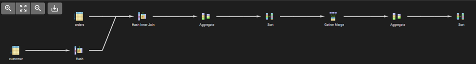
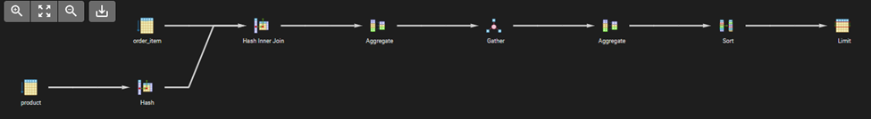
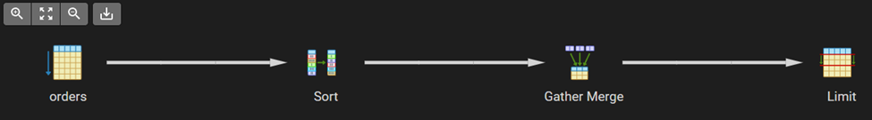
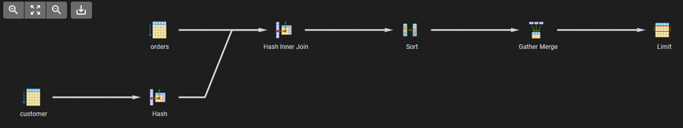
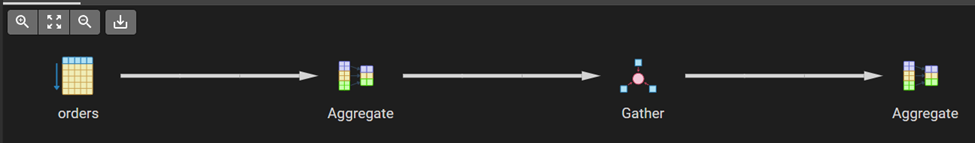
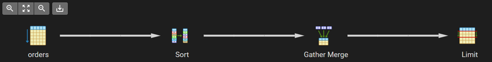

# Q1

## gráfica explain



## explain

```
"Sort  (cost=98645.08..98645.10 rows=10 width=41)"
"  Sort Key: (sum(o.total_amount)) DESC"
"  ->  Finalize GroupAggregate  (cost=98641.81..98644.91 rows=10 width=41)"
"        Group Key: c.city"
"        ->  Gather Merge  (cost=98641.81..98644.61 rows=24 width=41)"
"              Workers Planned: 2"
"              ->  Sort  (cost=97641.79..97641.81 rows=10 width=41)"
"                    Sort Key: c.city"
"                    ->  Partial HashAggregate  (cost=97641.50..97641.62 rows=10 width=41)"
"                          Group Key: c.city"
"                          ->  Parallel Hash Join  (cost=21569.00..95572.26 rows=413848 width=15)"
"                                Hash Cond: (o.customer_id = c.customer_id)"
"                                ->  Parallel Seq Scan on orders o  (cost=0.00..72916.90 rows=413848 width=14)"
"                                      Filter: ((order_date >= '2023-01-01 00:00:00+00'::timestamp with time zone) AND (order_date < '2024-01-01 00:00:00+00'::timestamp with time zone))"
"                                ->  Parallel Hash  (cost=16360.67..16360.67 rows=416667 width=17)"
"                                      ->  Parallel Seq Scan on customer c  (cost=0.00..16360.67 rows=416667 width=17)"
```

## explain analyze
```

```

# Q2

## gráfica explain



## explain
```
"Limit  (cost=346998.55..346998.58 rows=10 width=21)"
"  ->  Sort  (cost=346998.55..347248.55 rows=100000 width=21)"
"        Sort Key: (sum(oi.quantity)) DESC"
"        ->  Finalize HashAggregate  (cost=343837.59..344837.59 rows=100000 width=21)"
"              Group Key: p.name"
"              ->  Gather  (cost=317637.59..342637.59 rows=240000 width=21)"
"                    Workers Planned: 2"
"                    ->  Partial HashAggregate  (cost=316637.59..317637.59 rows=100000 width=21)"
"                          Group Key: p.name"
"                          ->  Hash Join  (cost=3096.00..274971.30 rows=8333258 width=17)"
"                                Hash Cond: (oi.product_id = p.product_id)"
"                                ->  Parallel Seq Scan on order_item oi  (cost=0.00..249999.58 rows=8333258 width=12)"
"                                ->  Hash  (cost=1846.00..1846.00 rows=100000 width=21)"
"                                      ->  Seq Scan on product p  (cost=0.00..1846.00 rows=100000 width=21)"
"JIT:"
"  Functions: 16"
"  Options: Inlining false, Optimization false, Expressions true, Deforming true"
```

## explain analyze
```

```

# Q3

## gráfica explain



## explain
```
"Limit  (cost=68708.70..68709.28 rows=5 width=34)"
"  ->  Gather Merge  (cost=68708.70..68709.28 rows=5 width=34)"
"        Workers Planned: 2"
"        ->  Sort  (cost=67708.68..67708.68 rows=2 width=34)"
"              Sort Key: order_date DESC"
"              ->  Parallel Seq Scan on orders  (cost=0.00..67708.67 rows=2 width=34)"
"                    Filter: (customer_id = 12345)"
```

## explain analyze
```

```

# Q4

## gráfica explain



## explain
```
"Limit  (cost=113803.29..113805.62 rows=20 width=21)"
"  ->  Gather Merge  (cost=113803.29..338737.10 rows=1931318 width=21)"
"        Workers Planned: 2"
"        ->  Sort  (cost=112803.26..114815.05 rows=804716 width=21)"
"              Sort Key: o.total_amount DESC"
"              ->  Parallel Hash Join  (cost=21569.00..91390.06 rows=804716 width=21)"
"                    Hash Cond: (o.customer_id = c.customer_id)"
"                    ->  Parallel Seq Scan on orders o  (cost=0.00..67708.67 rows=804716 width=14)"
"                          Filter: (total_amount > '500'::numeric)"
"                    ->  Parallel Hash  (cost=16360.67..16360.67 rows=416667 width=23)"
"                          ->  Parallel Seq Scan on customer c  (cost=0.00..16360.67 rows=416667 width=23)"
"JIT:"
"  Functions: 14"
"  Options: Inlining false, Optimization false, Expressions true, Deforming true"
```

## explain analyze
```

```

# Q5

## gráfica explain



## explain
```
"Finalize Aggregate  (cost=79207.48..79207.49 rows=1 width=8)"
"  ->  Gather  (cost=79207.26..79207.47 rows=2 width=8)"
"        Workers Planned: 2"
"        ->  Partial Aggregate  (cost=78207.26..78207.27 rows=1 width=8)"
"              ->  Parallel Seq Scan on orders  (cost=0.00..78125.33 rows=32772 width=0)"
"                    Filter: (order_date >= (now() - '30 days'::interval))"
```

## explain analyze
```

```
# Q6

## gráfica explain



## explain
```

```

## explain analyze
```
"Limit  (cost=68708.91..68709.49 rows=5 width=14)"
"  ->  Gather Merge  (cost=68708.91..68709.49 rows=5 width=14)"
"        Workers Planned: 2"
"        ->  Sort  (cost=67708.88..67708.89 rows=2 width=14)"
"              Sort Key: total_amount DESC"
"              ->  Parallel Seq Scan on orders  (cost=0.00..67708.88 rows=2 width=14)"
"                    Filter: (customer_id = 9876)"
```
