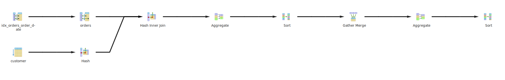
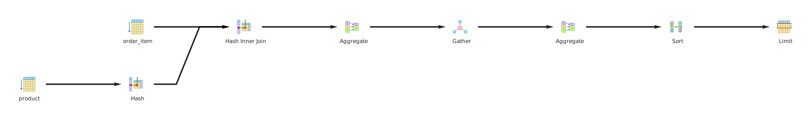
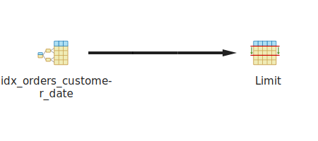
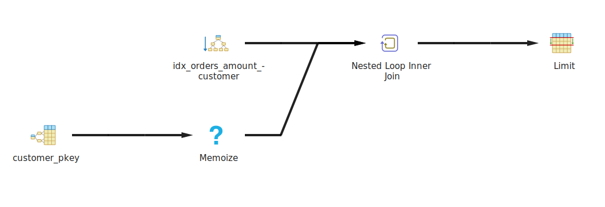
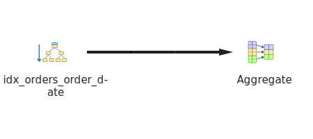
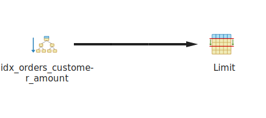

# QUERY 1

## GRÁFICA EXPLAIN



## EXPLAIN
```
"Sort  (cost=95446.13..95446.15 rows=10 width=41)"
"  Sort Key: (sum(o.total_amount)) DESC"
"  ->  Finalize GroupAggregate  (cost=95442.86..95445.96 rows=10 width=41)"
"        Group Key: c.city"
"        ->  Gather Merge  (cost=95442.86..95445.66 rows=24 width=41)"
"              Workers Planned: 2"
"              ->  Sort  (cost=94442.84..94442.86 rows=10 width=41)"
"                    Sort Key: c.city"
"                    ->  Partial HashAggregate  (cost=94442.55..94442.67 rows=10 width=41)"
"                          Group Key: c.city"
"                          ->  Parallel Hash Join  (cost=43176.94..92321.31 rows=424248 width=15)"
"                                Hash Cond: (o.customer_id = c.customer_id)"
"                                ->  Parallel Bitmap Heap Scan on orders o  (cost=21608.93..69639.65 rows=424248 width=14)"
"                                      Recheck Cond: ((order_date >= '2023-01-01 00:00:00+00'::timestamp with time zone) AND (order_date < '2024-01-01 00:00:00+00'::timestamp with time zone))"
"                                      ->  Bitmap Index Scan on idx_orders_order_date  (cost=0.00..21354.38 rows=1018195 width=0)"
"                                            Index Cond: ((order_date >= '2023-01-01 00:00:00+00'::timestamp with time zone) AND (order_date < '2024-01-01 00:00:00+00'::timestamp with time zone))"
"                                ->  Parallel Hash  (cost=16359.67..16359.67 rows=416667 width=17)"
"                                      ->  Parallel Seq Scan on customer c  (cost=0.00..16359.67 rows=416667 width=17)"
```
## EXPLAIN ANALYZE
```
"Sort  (cost=95446.13..95446.15 rows=10 width=41) (actual time=3256.783..3265.937 rows=10.00 loops=1)"
"  Sort Key: (sum(o.total_amount)) DESC"
"  Sort Method: quicksort  Memory: 25kB"
"  Buffers: shared hit=17 read=56599"
"  ->  Finalize GroupAggregate  (cost=95442.86..95445.96 rows=10 width=41) (actual time=3256.717..3265.917 rows=10.00 loops=1)"
"        Group Key: c.city"
"        Buffers: shared hit=17 read=56599"
"        ->  Gather Merge  (cost=95442.86..95445.66 rows=24 width=41) (actual time=3256.704..3265.878 rows=30.00 loops=1)"
"              Workers Planned: 2"
"              Workers Launched: 2"
"              Buffers: shared hit=17 read=56599"
"              ->  Sort  (cost=94442.84..94442.86 rows=10 width=41) (actual time=3242.667..3242.681 rows=10.00 loops=3)"
"                    Sort Key: c.city"
"                    Sort Method: quicksort  Memory: 25kB"
"                    Buffers: shared hit=17 read=56599"
"                    Worker 0:  Sort Method: quicksort  Memory: 25kB"
"                    Worker 1:  Sort Method: quicksort  Memory: 25kB"
"                    ->  Partial HashAggregate  (cost=94442.55..94442.67 rows=10 width=41) (actual time=3242.622..3242.637 rows=10.00 loops=3)"
"                          Group Key: c.city"
"                          Batches: 1  Memory Usage: 32kB"
"                          Buffers: shared hit=1 read=56599"
"                          Worker 0:  Batches: 1  Memory Usage: 32kB"
"                          Worker 1:  Batches: 1  Memory Usage: 32kB"
"                          ->  Parallel Hash Join  (cost=43176.94..92321.31 rows=424248 width=15) (actual time=1109.051..2762.147 rows=333785.00 loops=3)"
"                                Hash Cond: (o.customer_id = c.customer_id)"
"                                Buffers: shared hit=1 read=56599"
"                                ->  Parallel Bitmap Heap Scan on orders o  (cost=21608.93..69639.65 rows=424248 width=14) (actual time=90.984..765.859 rows=333785.00 loops=3)"
"                                      Recheck Cond: ((order_date >= '2023-01-01 00:00:00+00'::timestamp with time zone) AND (order_date < '2024-01-01 00:00:00+00'::timestamp with time zone))"
"                                      Heap Blocks: exact=12975"
"                                      Buffers: shared hit=1 read=44406"
"                                      Worker 0:  Heap Blocks: exact=14585"
"                                      Worker 1:  Heap Blocks: exact=14107"
"                                      ->  Bitmap Index Scan on idx_orders_order_date  (cost=0.00..21354.38 rows=1018195 width=0) (actual time=82.557..82.558 rows=1001355.00 loops=1)"
"                                            Index Cond: ((order_date >= '2023-01-01 00:00:00+00'::timestamp with time zone) AND (order_date < '2024-01-01 00:00:00+00'::timestamp with time zone))"
"                                            Index Searches: 1"
"                                            Buffers: shared hit=1 read=2739"
"                                ->  Parallel Hash  (cost=16359.67..16359.67 rows=416667 width=17) (actual time=1014.973..1014.975 rows=333333.33 loops=3)"
"                                      Buckets: 1048576  Batches: 1  Memory Usage: 59968kB"
"                                      Buffers: shared read=12193"
"                                      ->  Parallel Seq Scan on customer c  (cost=0.00..16359.67 rows=416667 width=17) (actual time=0.697..461.952 rows=333333.33 loops=3)"
"                                            Buffers: shared read=12193"
"Planning:"
"  Buffers: shared hit=16"
"Planning Time: 0.259 ms"
"Execution Time: 3265.997 ms"
```

# QUERY 2

## GRÁFICA EXPLAIN



## EXPLAIN
```
"Limit  (cost=346999.88..346999.91 rows=10 width=21)"
"  ->  Sort  (cost=346999.88..347249.88 rows=100000 width=21)"
"        Sort Key: (sum(oi.quantity)) DESC"
"        ->  Finalize HashAggregate  (cost=343838.92..344838.92 rows=100000 width=21)"
"              Group Key: p.name"
"              ->  Gather  (cost=317638.92..342638.92 rows=240000 width=21)"
"                    Workers Planned: 2"
"                    ->  Partial HashAggregate  (cost=316638.92..317638.92 rows=100000 width=21)"
"                          Group Key: p.name"
"                          ->  Hash Join  (cost=3096.00..274972.26 rows=8333333 width=17)"
"                                Hash Cond: (oi.product_id = p.product_id)"
"                                ->  Parallel Seq Scan on order_item oi  (cost=0.00..250000.33 rows=8333333 width=12)"
"                                ->  Hash  (cost=1846.00..1846.00 rows=100000 width=21)"
"                                      ->  Seq Scan on product p  (cost=0.00..1846.00 rows=100000 width=21)"
"JIT:"
"  Functions: 16"
"  Options: Inlining false, Optimization false, Expressions true, Deforming true"
```
## EXPLAIN ANALYZE
```
"Limit  (cost=346999.88..346999.91 rows=10 width=21) (actual time=39554.921..39555.464 rows=10.00 loops=1)"
"  Buffers: shared hit=1692 read=167513"
"  ->  Sort  (cost=346999.88..347249.88 rows=100000 width=21) (actual time=39417.240..39417.772 rows=10.00 loops=1)"
"        Sort Key: (sum(oi.quantity)) DESC"
"        Sort Method: top-N heapsort  Memory: 26kB"
"        Buffers: shared hit=1692 read=167513"
"        ->  Finalize HashAggregate  (cost=343838.92..344838.92 rows=100000 width=21) (actual time=39263.803..39344.203 rows=100000.00 loops=1)"
"              Group Key: p.name"
"              Batches: 1  Memory Usage: 9241kB"
"              Buffers: shared hit=1692 read=167513"
"              ->  Gather  (cost=317638.92..342638.92 rows=240000 width=21) (actual time=38592.691..38953.992 rows=300000.00 loops=1)"
"                    Workers Planned: 2"
"                    Workers Launched: 2"
"                    Buffers: shared hit=1692 read=167513"
"                    ->  Partial HashAggregate  (cost=316638.92..317638.92 rows=100000 width=21) (actual time=38556.939..38691.059 rows=100000.00 loops=3)"
"                          Group Key: p.name"
"                          Batches: 1  Memory Usage: 7193kB"
"                          Buffers: shared hit=1692 read=167513"
"                          Worker 0:  Batches: 1  Memory Usage: 9241kB"
"                          Worker 1:  Batches: 1  Memory Usage: 9241kB"
"                          ->  Hash Join  (cost=3096.00..274972.26 rows=8333333 width=17) (actual time=275.474..26794.060 rows=6666666.67 loops=3)"
"                                Hash Cond: (oi.product_id = p.product_id)"
"                                Buffers: shared hit=1692 read=167513"
"                                ->  Parallel Seq Scan on order_item oi  (cost=0.00..250000.33 rows=8333333 width=12) (actual time=0.153..8093.867 rows=6666666.67 loops=3)"
"                                      Buffers: shared read=166667"
"                                ->  Hash  (cost=1846.00..1846.00 rows=100000 width=21) (actual time=274.730..274.732 rows=100000.00 loops=3)"
"                                      Buckets: 131072  Batches: 1  Memory Usage: 6493kB"
"                                      Buffers: shared hit=1692 read=846"
"                                      ->  Seq Scan on product p  (cost=0.00..1846.00 rows=100000 width=21) (actual time=8.926..138.059 rows=100000.00 loops=3)"
"                                            Buffers: shared hit=1692 read=846"
"Planning:"
"  Buffers: shared hit=72 read=17"
"Planning Time: 5.822 ms"
"JIT:"
"  Functions: 62"
"  Options: Inlining false, Optimization false, Expressions true, Deforming true"
"  Timing: Generation 5.006 ms (Deform 2.665 ms), Inlining 0.000 ms, Optimization 23.466 ms, Emission 140.978 ms, Total 169.449 ms"
"Execution Time: 40126.467 ms"
```
# QUERY 3

## GRÁFICA EXPLAIN



## EXPLAIN
```
"Limit  (cost=0.43..28.54 rows=6 width=34)"
"  ->  Index Scan using idx_orders_customer_date on orders  (cost=0.43..28.54 rows=6 width=34)"
"        Index Cond: (customer_id = 12345)"
```
## EXPLAIN ANALYZE
```
"Limit  (cost=0.43..28.54 rows=6 width=34) (actual time=0.051..0.076 rows=6.00 loops=1)"
"  Buffers: shared hit=6 read=3"
"  ->  Index Scan using idx_orders_customer_date on orders  (cost=0.43..28.54 rows=6 width=34) (actual time=0.049..0.067 rows=6.00 loops=1)"
"        Index Cond: (customer_id = 12345)"
"        Index Searches: 1"
"        Buffers: shared hit=6 read=3"
"Planning Time: 0.114 ms"
"Execution Time: 0.098 ms"
```
# QUERY 4

## GRÁFICA EXPLAIN



## EXPLAIN
```
"Limit  (cost=0.87..9.66 rows=20 width=21)"
"  ->  Nested Loop  (cost=0.87..852597.34 rows=1938971 width=21)"
"        ->  Index Only Scan using idx_orders_amount_customer on orders o  (cost=0.43..63800.43 rows=1938971 width=14)"
"              Index Cond: (total_amount > '500'::numeric)"
"        ->  Memoize  (cost=0.43..0.48 rows=1 width=23)"
"              Cache Key: o.customer_id"
"              Cache Mode: logical"
"              ->  Index Scan using customer_pkey on customer c  (cost=0.42..0.47 rows=1 width=23)"
"                    Index Cond: (customer_id = o.customer_id)"
```
## EXPLAIN ANALYZE
```
"Limit  (cost=0.87..9.66 rows=20 width=21) (actual time=1.733..1.905 rows=20.00 loops=1)"
"  Buffers: shared hit=89"
"  ->  Nested Loop  (cost=0.87..852597.34 rows=1938971 width=21) (actual time=1.731..1.882 rows=20.00 loops=1)"
"        Buffers: shared hit=89"
"        ->  Index Only Scan using idx_orders_amount_customer on orders o  (cost=0.43..63800.43 rows=1938971 width=14) (actual time=0.019..0.035 rows=20.00 loops=1)"
"              Index Cond: (total_amount > '500'::numeric)"
"              Heap Fetches: 0"
"              Index Searches: 1"
"              Buffers: shared hit=9"
"        ->  Memoize  (cost=0.43..0.48 rows=1 width=23) (actual time=0.090..0.091 rows=1.00 loops=20)"
"              Cache Key: o.customer_id"
"              Cache Mode: logical"
"              Hits: 0  Misses: 20  Evictions: 0  Overflows: 0  Memory Usage: 3kB"
"              Buffers: shared hit=80"
"              ->  Index Scan using customer_pkey on customer c  (cost=0.42..0.47 rows=1 width=23) (actual time=0.004..0.004 rows=1.00 loops=20)"
"                    Index Cond: (customer_id = o.customer_id)"
"                    Index Searches: 20"
"                    Buffers: shared hit=80"
"Planning:"
"  Buffers: shared hit=16"
"Planning Time: 0.262 ms"
"Execution Time: 1.944 ms"
```

# QUERY 5

## GRÁFICA EXPLAIN



## EXPLAIN
```
"Aggregate  (cost=2489.44..2489.45 rows=1 width=8)"
"  ->  Index Only Scan using idx_orders_order_date on orders  (cost=0.44..2288.81 rows=80250 width=0)"
"        Index Cond: (order_date >= (now() - '30 days'::interval))"
```
## EXPLAIN ANALYZE
```
"Aggregate  (cost=2489.18..2489.19 rows=1 width=8) (actual time=114.540..114.543 rows=1.00 loops=1)"
"  Buffers: shared hit=27319 read=223"
"  ->  Index Only Scan using idx_orders_order_date on orders  (cost=0.44..2288.59 rows=80237 width=0) (actual time=0.053..61.926 rows=80934.00 loops=1)"
"        Index Cond: (order_date >= (now() - '30 days'::interval))"
"        Heap Fetches: 0"
"        Index Searches: 1"
"        Buffers: shared hit=27319 read=223"
"Planning:"
"  Buffers: shared hit=4"
"Planning Time: 0.134 ms"
"Execution Time: 114.574 ms"
```

# QUERY 6

## GRÁFICA EXPLAIN



## EXPLAIN
```
"Limit  (cost=0.43..3.85 rows=5 width=14)"
"  ->  Index Only Scan using idx_orders_customer_amount on orders  (cost=0.43..4.54 rows=6 width=14)"
"        Index Cond: (customer_id = 9876)"
```
## EXPLAIN ANALYZE
```
"Limit  (cost=0.43..3.85 rows=5 width=14) (actual time=0.020..0.030 rows=4.00 loops=1)"
"  Buffers: shared hit=6"
"  ->  Index Only Scan using idx_orders_customer_amount on orders  (cost=0.43..4.54 rows=6 width=14) (actual time=0.018..0.023 rows=4.00 loops=1)"
"        Index Cond: (customer_id = 9876)"
"        Heap Fetches: 0"
"        Index Searches: 1"
"        Buffers: shared hit=6"
"Planning Time: 0.093 ms"
"Execution Time: 0.050 ms"
```